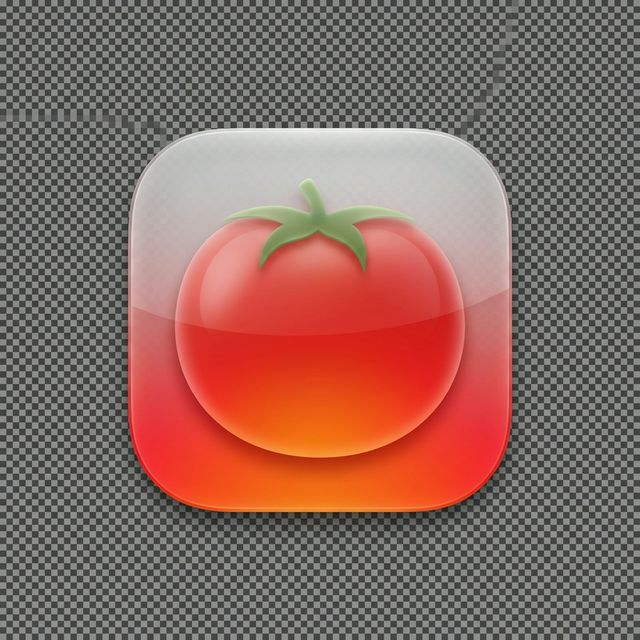

# 🍅 Twilight Pomodoro

A premium, high-fidelity Pomodoro timer built with **Flutter**, designed specifically for a seamless **macOS** experience. Featuring a stunning "Twilight Aurora" aesthetic and deep native integrations.



## 🎥 Demo


## 📥 Download

[**Download for macOS (.zip)**](Twilight_Pomodoro_macOS_v0.0.3_b8.zip)

### 🚀 First Time Setup
If macOS says the app "cannot be verified":
1. Open your terminal.
2. Type `xattr -cr ` (add a space at the end) but **don't press enter** yet.
3. **Drag and drop** the `Twilight Pomodoro.app` from your folder into the terminal window.
4. Press **Enter**.
5. You can now open the app normally!

*This is a one-time step required for unnotarized community builds.*

---

## ✨ Features

### 🎨 Premium Aesthetics
- **Twilight Aurora Design**: A deep, immersive dark mode using Frosted Glass (Glassmorphism) and vibrant gradients.
- **Micro-animations**: Smooth transitions and rhythmic pulses that breathe life into the timer.
- **Custom Iconography**: Hand-crafted, modern silhouette icons that adapt to your system theme.

### 🧘 Health-First Productivity
- **20-20-20 Eye Care Rule**: Automatic interruptions every 20 minutes to prevent digital eye strain.
- **Smart Sessions**: Seamlessly toggle between Focused Work, Short Breaks, and Long Rest periods.
- **Custom Mode**: Fully configurable work and break durations tailored to your specific workflow (e.g., 50m work / 10m break).
- **Resume Prompts**: Mindful transitions that ensure you're ready to start before the timer begins ticking.

### 💻 Native macOS Integration
- **Menu Bar Extra (Tray)**: View your remaining time directly in the macOS menu bar. 
- **Focus Terminal (V5)**: A clean, strictly rectangular Swift (WidgetKit) widget with drift protection and instant app synchronization.
- **High-Fidelity Audio**: Custom-designed "Smooth Notification" alert sounds for a pleasant focus environment.
- **Lock Screen Persistence**: Critical alerts that stay visible when your Mac is locked.

---

## 🛠️ Built With

- **Framework**: [Flutter](https://flutter.dev)
- **Language**: Dart & Swift
- **Native APIs**: WidgetKit, AppIntents, UserDefaults (App Groups), FlutterMethodChannel
- **State Management**: Clean architecture with service-oriented logic

---

## 🚀 Getting Started

### Prerequisites
- Flutter SDK (latest version)
- Xcode (15.0+ for WidgetKit support)
- macOS 11.0+

### Installation

1. **Clone the repository**
   ```bash
   git clone https://github.com/abhishekdoshi/twilight_pomodoro.git
   cd twilight_pomodoro
   ```

2. **Automated Build & Deploy (macOS)**
   Run our deployment script to clean, install pods, build the release, and create a distributable ZIP in one command:
   ```bash
   ./scripts/deploy_macos.sh
   ```

3. **Manual macOS Native Setup**
   ```bash
   cd macos
   pod install
   ```

4. **Enable App Groups (For Widget Sync)**
   - Open `macos/Runner.xcworkspace` in Xcode.
   - Go to **Signing & Capabilities**.
   - Add the **App Groups** capability to both the **Runner** and **extension** targets.
   - Use the ID: `group.com.abhishek.pomodoro`.

5. **Run the App**
   ```bash
   flutter run
   ```

---

## 📸 Design Preview

| Focus Mode | Eye Care Break | macOS Widget |
| :---: | :---: | :---: |
| Deep Indigo Aurora | Glassmorphic Alert | Minimalist Swift UI |

---

## 📜 License

Distributed under the MIT License. See `LICENSE` for more information.

---

**Crafted with ❤️ for deep work.**
